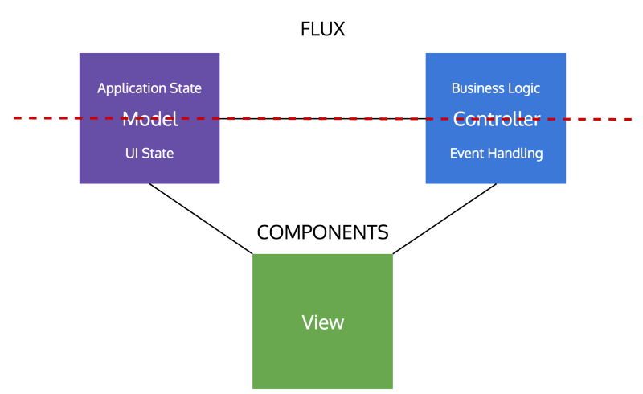

**abandonando o MVC no client-side**

A primeira vez que me deparei com a estrutura de um projeto desenvolvido em React + Redux, fiquei realmente confuso.
O meu background era Java e Spring MVC e ao decidir aprender React não sabia que teria de mudar complemente o paradigma de arquitetura de software com que estava acostumado.
E confesso que demorou até a ficha cair.
Para realmente aprender React (e Redux) é preciso transitar do paradigma de arquitetura MVC (Model-View-Controller) e abraçar 2 novos paradigmas que juntos formam a estrutura de uma moderna aplicação web:

“Arquitetura baseada em Componentes (React) + Arquitetura Unidirecional (Redux)”

Esse post é uma tentativa de acelerar o processo de aprendizagem do React e do Redux para quem, como eu, vem de uma experiência mais back-end acostumado com o tão propalado MVC.

**React é muito mais do que uma library para a View da sua aplicação**

Quando o React foi introduzido em 2013, o próprio Facebook propagandeou a bibliotaca como o “V” do MVC.
Ou seja, como apenas uma biblioteca de renderização que utilizava o inovador conceito de Virtual DOM para aumentar a performance da aplicação.
Essa decisão do Facebook de “esconder” as grandes inovações em termos de arquitetura que o React trazia foi provavelmente uma jogada de marketing para facilitar a adesão da biblioteca na comunidade de programadores tanto que, em 2015,
após uma famosa postagem de Dan Abramov, “You’re Missing the point of React”, o Facebook retirou essa frase da documentação.

Mas quais seriam essas inovações?
Em primeiro lugar, o abandono da arquitetura em Layers para a utilização de uma arquitetura mais próxima do feature-based, os Componentes,
e em segundo lugar a aplicação do Flux – fluxo de dados unidirecional.
Você pode assistir a equipe do Facebook dando a explicação para a adoção desses dois paradigmas no Youtube: Hacker Way: Rethinking Web App Development at Facebook

A biblioteca Redux tornou-se a mais utilizada aplicação do conceito Flux introduzido pelo Facebook, tornando-se quase indispensável em projetos React.

**Quais problemas essas mudanças estruturais vieram resolver?**

A implementação dessa nova arquitetura foi uma resposta aos vários desafios que surgiram ao se tentar implementar o MVC no client-side.
Esses desafios surgiram tanto no Model quanto no Controller, o (M) e o (C) do MVC.

No caso do Controller, enquanto nas aplicações server-side haviam basicamente dois pontos de contato entre o Controller no servidor e a View no cliente - o fluxo de dados bidirecional -, para aplicações client-side,
o Controller acabava por se comportar de forma extremamente dependente da View com muitos pontos de contato, gerando efeitos de cascata e tornando extremamente dificil gerir o fluxo de dados entre as duas layers.

Na layer do Modelo, havia o problema de gerir states com caracteristicas muito diferentes. De um lado, há aqueles states relacionados apenas com um componente, são chamados **UI states**,
componentes da interface do usuário, que lidam mais diretamente com a interação do usuário e alteram pequenas parcelas da View.
Por outro lado, existem states que precisam ser compartilhados com toda a aplicação, ou com muitos componentes e páginas da aplicação.
A esses componentes chamamos **Application states**. Havia, portanto, a quebra do princípio de reponsabilidade única, uma das principais vantagens da arquitetura MVC.

**Como a Arquitetura Baseada em Componentes (React) associada a Arquitetura Unidirecional (Redux) se unem para resolver esses problemas?**

Os Componentes popularizados pelo React reunem em uma única classe as três layers do MVC atreladas a uma fração da UI.
Temos o JSX que corresponde a View. Temos os Event Handlers que correspondem ao Controller. E temos os states que correspondem ao Modelo. Porém, no que diz respeito ao Controller e ao Model,
os Componentes normalmente estão responsáveis apenas pela parte dessas layers que dizem respeito àquela fração da UI - são os UI states e os Event Handlers daquela fração da UI que o Componente controla.
Mas e quanto a lógica de negócio da aplicação e a estrutura de dados que dizem respeito à aplicação como um todo?

Existem dois tipos de states – há aqueles states relacionados apenas com um componente, são chamados UI states, componentes da interface do usuário,
e existem states que precisam ser compartilhados com toda a aplicação, ou com muitos componentes e páginas da aplicação.
A esses componentes chamamos application states.
Ao mesmo tempo, temos métodos que servem para modificar estados de um único componente (ou poucos componentes) e outros que agem como business logic da aplicação, afetando-a de uma forma muito mais abrangente.
É aí que entra o Redux. A biblioteca existe para cuidar justamente dos Application States e da lógica de negócio da aplicação, enquanto os UI states continuam a ser geridos dentro do ciclo de vida do componentes.

A arquitetura baseada em componentes do React abandona a ideia de responsabilidade única por camadas da aplicação,
para dividir a aplicação em pequenas frações de funcionalidade com alto grau de independência e reusabilidade.
Por outro lado, o Redux resolve o problema do "two way data binding" e dos efeitos em cascata entre View e Model ao introduzir a arquitetura unidirecional
para cuidar dos Application States e da business logic da aplicação. Mas os detalhes dessa arquitetura eu irei deixar para um próximo post.

A imagem abaixo resume bem qual a competência do React e do Redux na arquitetura de uma aplicação WEB moderna (ou Native). É interessante notar que as duas libraries juntas cobrem todo o espectro
de uma arquitetura MVC, porém com a divisão de competências entre o React e o Redux no Model e no Controller.

Até uma próxima, pessoal. Qualquer dúvida ou comentários, fiquem a vontade para postar.

Imagem retirada do excelente artigo de Alex Moldovan: "Is Model-View-Controller dead on the front end?"
